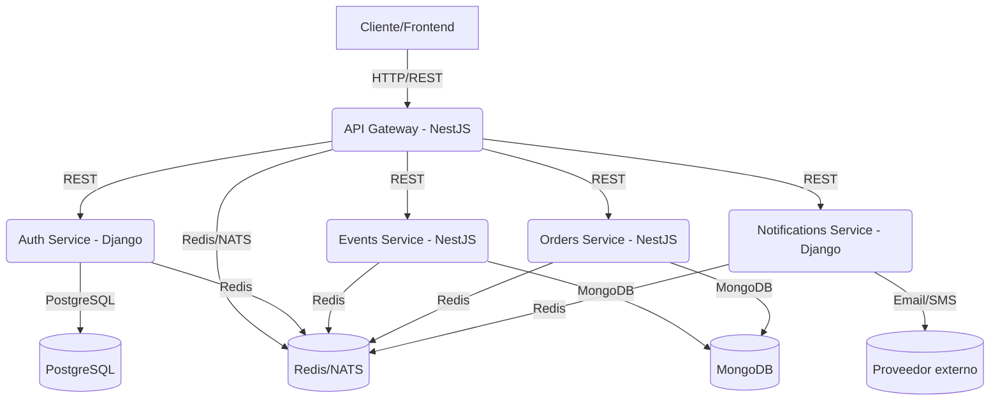

**Descripción:**
- El cliente se comunica con el API Gateway.
- El Gateway enruta peticiones a los microservicios.
- Cada microservicio usa su propia base de datos.
- Redis/NATS se usa para cache, colas y eventos.
- Notificaciones puede interactuar con servicios externos (email/SMS).
