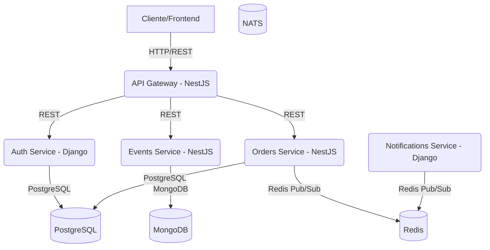

**Descripción:**
- El cliente se comunica con el API Gateway.
- El Gateway enruta autenticación, eventos y órdenes hacia sus microservicios dueños.
- `auth-service` usa PostgreSQL para usuarios y JWT.
- `events-service` usa MongoDB para el catálogo público.
- `orders-service` usa PostgreSQL para stock real y órdenes.
- `orders-service` publica `ORDER_CONFIRMED` en Redis.
- `notifications-service` consume ese evento y simula la notificación mediante logs.
- NATS permanece en la infraestructura del proyecto, pero no participa en el flujo principal implementado hasta Sprint 3.
