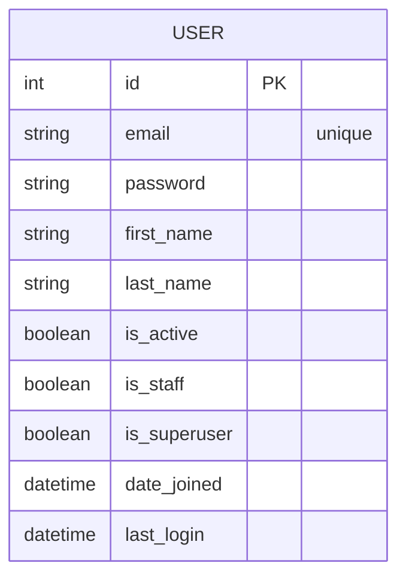

## Entidades principales

### User
- id (PK)
- email (unique)
- password
- first_name
- last_name
- is_active
- is_staff
- is_superuser
- date_joined
- last_login

## Diagrama ER (Mermaid)

Si se agregan más entidades (roles, perfiles, etc.), este diagrama se puede ampliar fácilmente.
