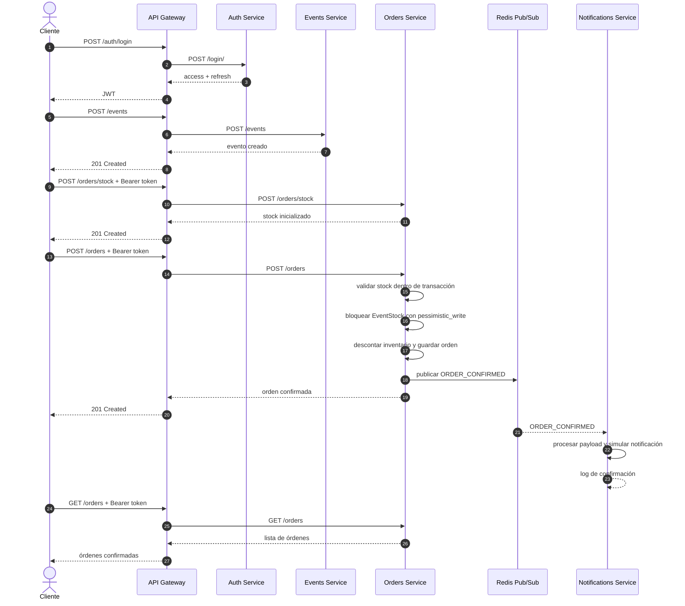

# Diagrama de Secuencia: Compra de Ticket

```mermaid
sequenceDiagram
  autonumber
  actor Cliente
  participant Gateway as API Gateway
  participant Auth as Auth Service
  participant Events as Events Service
  participant Orders as Orders Service
  participant Redis as Redis Pub/Sub
  participant Notifications as Notifications Service

  Cliente->>Gateway: POST /auth/login
  Gateway->>Auth: POST /login/
  Auth-->>Gateway: access + refresh
  Gateway-->>Cliente: JWT

  Cliente->>Gateway: POST /events
  Gateway->>Events: POST /events
  Events-->>Gateway: evento creado
  Gateway-->>Cliente: 201 Created

  Cliente->>Gateway: POST /orders/stock + Bearer token
  Gateway->>Orders: POST /orders/stock
  Orders-->>Gateway: stock inicializado
  Gateway-->>Cliente: 201 Created

  Cliente->>Gateway: POST /orders + Bearer token
  Gateway->>Orders: POST /orders
  Orders->>Orders: validar stock dentro de transacción
  Orders->>Orders: bloquear EventStock con pessimistic_write
  Orders->>Orders: descontar inventario y guardar orden
  Orders->>Redis: publicar ORDER_CONFIRMED
  Orders-->>Gateway: orden confirmada
  Gateway-->>Cliente: 201 Created

  Redis-->>Notifications: ORDER_CONFIRMED
  Notifications->>Notifications: procesar payload y simular notificación
  Notifications-->>Notifications: log de confirmación

  Cliente->>Gateway: GET /orders + Bearer token
  Gateway->>Orders: GET /orders
  Orders-->>Gateway: lista de órdenes
  Gateway-->>Cliente: órdenes confirmadas
```